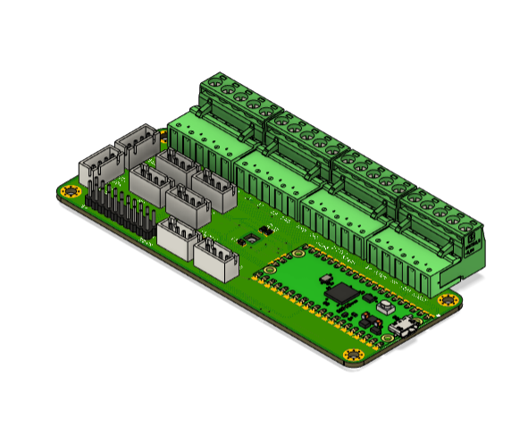
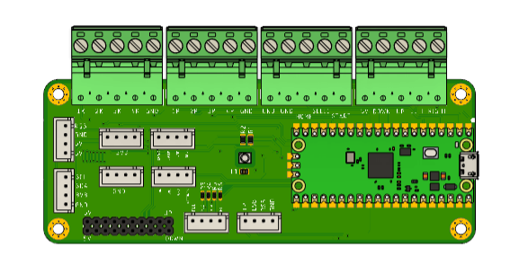
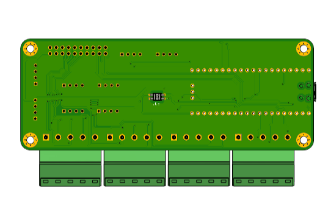
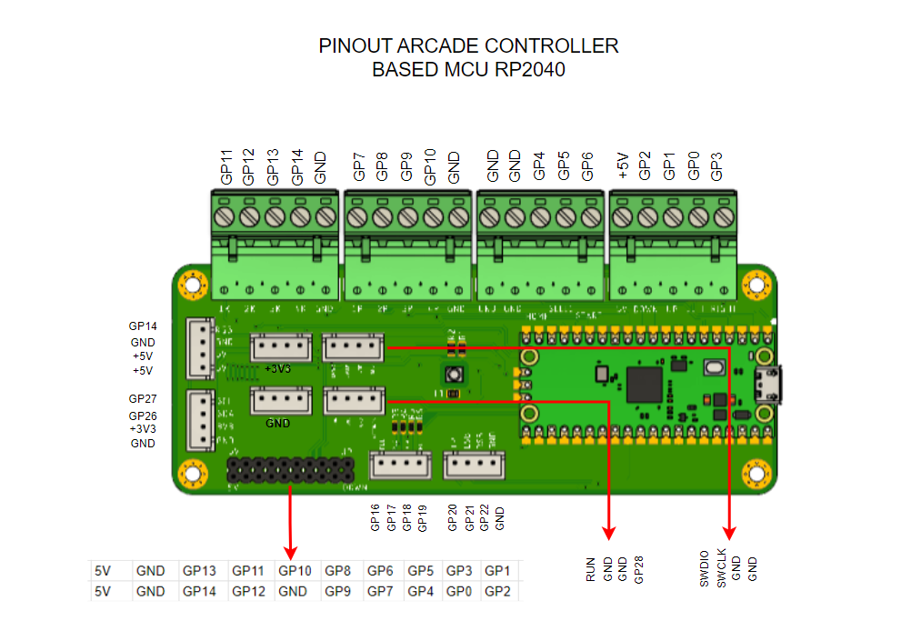

# Arcade_Controller_GP2040
Hardware and Firmware of Arcade Controller Based RP2040 as Microcontroller and GP2040 as Frimware

# Spesification
- Input Power VIA USB 5VDC
- GP2040 Controller Firmware
- Plugable Terminal Block and molex JST-XH for Port To External Item
- Pin Header 2x10 2.54 for Port To External Item
- LED RGB on BOARD
- Support RP2040 Raspberry Pi PICO or Weact RP2040
- I2C Port 
- LED Player Port with Resistor On board 330OHM
- 3v3 and GND port Molex for external perpose

# Privew Hardware 

  
  
  
  
  
  

# Pinout
## Pinout RP2040

  

# Documentation 
- [Dimension](https://github.com/juarendra/Arcade_Controller_GP2040/blob/main/3D/Dimension_arcadeController.pdf)
- [BOM](https://github.com/juarendra/Arcade_Controller_GP2040/blob/main/DOC/bom.csv)
- [Pinout RP2040](https://github.com/juarendra/Arcade_Controller_GP2040/blob/main/DOC/Arcade_Controller_GP2040_Pinout.pdf)

